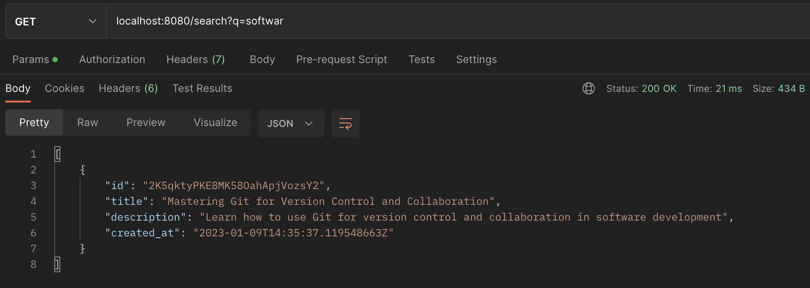

# CQRS

This project presents an API that allows you to store feeds with a title and description.
Feeds can be created, listed, searched by title or description (whithout having to use
the same exact words), all using HTTP REST. Also, you can establish a web
socket connection, which will allow you to be notified every time a new feed is created.
To see more on its use, see the instructions section below.

An important feature of this API is the fact that it uses a CQRS(Command Query Responsibility
Segregation) architecture, which allows the read and write services to scale independently.


The entry point for the API is exposed by an NGINX server, which redirects requests from the
user to 3 different services: The feed, query and pusher services. The feed service will receive
the requests to create a feed. The query service will handle any request to search for
a feed or to list all created feeds. Also, the pusher service will be in charge of web sockets
connections to notify the user of a new feed creation. There is also a Postgres DB to store all
feeds and an ElasticSearch cluster to index every feed for subsequent searches. Finally, a central
NATS broker allows the feed service to publish each created feed and notify to ElasticSearch
and the pusher service.

## Instructions

To run the application:

```console
  docker-compose up -d --build
```

Open a WebSocket connection. Every time a resource is created you will get notified:

```console
  localhost:8080/ws
```


Create some feeds:


- [POST] localhost:8080/feeds

  ```json
  {
    "title": "The Fascinating World of Quantum Computing: How It Works and Its Potential Impacts",
    "description": "Learn about the principles of quantum computing and how it could revolutionize various industries"
  }
  ```

- [POST] localhost:8080/feeds

  ```json
  {
    "title": "The Top 10 Healthy Habits for a Long and Happy Life",
    "description": "Discover simple habits to incorporate into your daily routine for improved health and well-being"
  }
  ```

- [POST] localhost:8080/feeds

  ```json
  {
    "title": "Mastering Git for Version Control and Collaboration",
    "description": "Learn how to use Git for version control and collaboration in software development"
  }
  ```

- [POST] localhost:8080/feeds

  ```json
  {
    "title": "The Best Places to Visit in South America: A Guide to the Continent's Top Destinations",
    "description": "Find a list of the top places to visit in South America and add them to your travel bucket list"
  }
  ```

- [POST] localhost:8080/feeds

  ```json
  {
    "title": "The Future of Work: How Artificial Intelligence and Automation Are Changing the Landscape",
    "description": "Learn about the ways in which artificial intelligence and automation are changing the world of work and what it means for the future"
  }
  ```

- [POST] localhost:8080/feeds

  ```json
  {
    "title": "The Benefits of Plant-Based Eating for Health and the Environment",
    "description": "Learn about the many benefits of a plant-based diet and how to incorporate more plant-based meals into your diet"
  }
  ```

- [POST] localhost:8080/feeds

  ```json
  {
    "title": "The Top 10 Hiking Trails in the United States",
    "description": "Discover the best hiking trails in the United States and add them to your outdoor adventure list"
  }
  ```

- [POST] localhost:8080/feeds

  ```json
  {
    "title": "The Science of Sleep: How It Affects Your Health and Well-Being",
    "description": "Learn about the importance of sleep and how to improve your sleep habits for better health and well-being"
  }
  ```

- [POST] localhost:8080/feeds

  ```json
  {
    "title": "The Economic Impact of the COVID-19 Pandemic: A Global Perspective",
    "description": "Understand the ways in which the COVID-19 pandemic has impacted the global economy and what it means for the future"
  }
  ```

- [POST] localhost:8080/feeds

  ```json
  {
    "title": "The Top 5 Apps for Improved Mental Health and Wellness",
    "description": "Find a list of the top mental health and wellness apps to help improve your mental well-being"
  }
  ```

Get all the feeds you have created:


- [GET] localhost:8080/feeds

And now look for some interesting feed for you:



- [GET] localhost:8080/search?q=softwar
